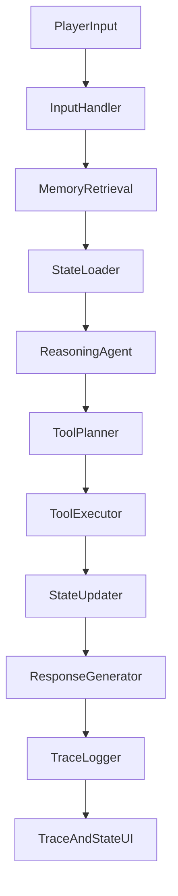

# 项目选题计划：Memory-Driven Interactive Character Agent

> 当前状态说明：本文是项目早期选题计划，保留为课程需求和范围参考。当前实现已经超过早期计划中的单 NPC / 简单关键词检索阶段，包含 Lina、Ron、Mira、Sable 四 NPC，Hybrid RAG、lore/context 分层、FastAPI + React 玩家端、后台 memory worker、LLM 友好长期记忆类型和 46 个自动测试。当前实现状态请以根目录 `README.md` 与 `docs/design/` 为准。

## 1. 项目名称

**Memory-Driven Interactive Character Agent：基于记忆、状态管理与工具调用的交互式角色智能体系统**

可选中文标题：

**基于大语言模型的记忆驱动角色智能体设计与实现**

---

## 2. 项目背景与动机

在连续交互任务中，大语言模型如果只根据当前输入生成回复，往往缺少稳定的角色状态、长期记忆和可验证的行动结果。无论用户之前做过什么、承诺过什么、是否改变过系统状态，模型都可能只给出表面合理但缺乏连续性的回答。

大模型智能体为这一问题提供了新的解决思路：Agent 不仅生成自然语言，还应具备角色设定、长期记忆、当前状态、任务目标和工具调用能力，并能通过外部工具改变环境变量、记录事件和更新后续决策依据。

本项目以文字冒险中的 NPC 交互作为可控实验场景，但重点不是开发完整游戏，而是构建一个具备以下能力的记忆驱动角色 Agent：

- 能够记住玩家过往行为；
- 能够根据记忆、角色设定和当前状态生成不同回应；
- 能够调用工具修改信任度、任务状态、背包、地点解锁等环境变量；
- 能够将工具调用结果写回状态系统，影响后续交互；
- 能够可视化展示 Agent 的推理流程、记忆检索和工具调用日志。

因此，文字冒险只是展示 Agent 能力的外壳。本项目真正关注的是 **LLM Agent 在连续交互场景中的状态管理、记忆机制、工具调用机制与可解释执行轨迹**。

---

## 3. 项目目标

### 3.1 总体目标

构建一个基于大语言模型的记忆驱动角色 Agent 原型系统。系统以文字冒险 NPC 为实验对象，使 Agent 能够在多轮交互中读取角色状态、检索长期记忆、进行结构化决策、调用工具更新环境，并把执行轨迹保存和展示出来。

### 3.2 核心目标

项目计划实现的核心功能包括：

1. 一个可运行的 Agent 交互 Web 界面；
2. 一个高完成度的单 NPC Agent MVP；
3. 结构化角色卡、情绪、信任度、好感度和任务状态；
4. 支持玩家与 Agent 多轮自然语言交互；
5. 支持长期记忆写入、检索和重要性筛选；
6. 支持 Agent 调用工具修改系统状态；
7. 支持展示每轮交互的 Agent 执行轨迹；
8. 支持保存运行日志、工具调用记录和状态变化记录；
9. 在单 Agent 跑通后扩展到 2-3 个 NPC，用于验证系统泛化能力；
10. 形成 GitHub 项目、README、课程汇报 PPT 和书面报告。

---

## 4. 实验场景设计

### 4.1 场景定位

项目采用 **文字冒险式交互场景**，不制作复杂 2D/3D 画面。该场景的作用是为 Agent 提供稳定、可观察、可记录的任务环境，便于展示记忆检索、状态变化、工具调用和执行轨迹。

玩家主要通过自然语言与 NPC 交互，例如：

```text
我想打听一下地下遗迹的入口。
上次我帮你赶走了盗贼，这次能不能便宜一点？
我把你丢失的钥匙找回来了。
你为什么不相信那个商人？
```

### 4.2 推荐实验场景

推荐设计一个小型中世纪小镇场景，作为 Agent 能力验证环境：

```text
地点：
- 酒馆
- 商店
- 镇中心
- 地下遗迹入口

NPC：
- Lina：酒馆老板，谨慎、现实、掌握很多情报，作为第一阶段 MVP Agent
- Ron：小镇守卫，正直但多疑，作为第二阶段扩展 Agent
- Mira：早期计划中曾作为商人扩展角色；当前实现已调整为遗迹学者，商人/古物交易方向由 Sable 承担
```

### 4.3 示例任务线

玩家想进入地下遗迹，但入口被封锁。该任务线的重点不是剧情本身，而是验证 Agent 是否能在多轮交互中持续维护状态、记住关键事件、调用工具并根据状态变化调整后续回应。

可能验证流程：

1. 玩家来到酒馆，询问地下遗迹；
2. 酒馆老板 Lina 因为不信任玩家，只透露一部分线索；
3. 玩家帮助 Lina 解决酒馆盗贼事件，好感度上升；
4. Lina 告诉玩家需要找守卫 Ron 获取许可；
5. Ron 认为玩家可疑，需要玩家证明身份；
6. 玩家从商人 Mira 处获得旧地图；
7. Mira 可能根据玩家信誉改变价格；
8. 当玩家满足条件后，Agent 调用 `unlock_location` 解锁地下遗迹入口；
9. 系统在执行轨迹中展示记忆检索、决策依据、工具调用和状态变化。

### 4.4 实施路线

项目采用“先单 Agent，后多 Agent”的路线：

1. **第一阶段：单 NPC Agent MVP**
   - 只实现 Lina 一个 NPC；
   - 跑通角色卡、记忆、状态、工具调用、回复生成和日志展示的完整闭环；
   - 用固定任务线验证 Agent 是否真正受到历史记忆和状态变量影响。

2. **第二阶段：多 NPC 泛化**
   - 增加 Ron 和 Mira；
   - 所有 NPC 共用同一套 Agent workflow；
   - 通过 `npc_id` 区分角色卡、记忆、状态和交互日志。

3. **第三阶段：多智能体扩展**
   - 可选实现 NPC 间信息传播；
   - 展示不同角色之间的关系网络和间接记忆影响。

---

## 5. Agent 核心功能设计

### 5.1 NPC 角色卡

每个角色 Agent 都有结构化角色设定。角色卡不是简单人设文本，而是 Agent 推理时的状态输入之一。

示例：

```json
{
  "name": "Lina",
  "role": "Tavern Owner",
  "personality": "cautious, practical, observant",
  "goal": "Protect the tavern and collect useful information",
  "mood": "neutral",
  "affection": 30,
  "trust": 20,
  "inventory": ["healing_potion", "old_note"],
  "secret": "Knows that the underground ruins have a hidden side entrance"
}
```

角色卡用于约束 NPC 的语言风格、行为倾向和决策逻辑。

---

### 5.2 记忆系统

记忆系统是本项目的核心之一，也是区别普通聊天机器人和 Agent 系统的重要模块。记忆不仅用于让回复更自然，更重要的是作为后续决策、工具调用和状态更新的依据。

记忆分为三类：

| 记忆类型 | 说明 | 示例 |
|---|---|---|
| 短期记忆 | 最近几轮对话 | 玩家刚刚询问了地下遗迹 |
| 长期记忆 | 重要事件 | 玩家帮助 Lina 赶走了盗贼 |
| 关系记忆 | 玩家与 NPC 的关系变化 | Lina 对玩家信任度提升 |

示例记忆结构：

```json
{
  "npc": "Lina",
  "content": "Player helped drive away thieves from the tavern.",
  "importance": 8,
  "timestamp": "day_1_evening",
  "tags": ["help", "trust", "tavern"]
}
```

每轮对话流程：

```text
玩家输入
→ 检索相关记忆
→ 结合 NPC 角色卡和当前状态
→ 生成结构化决策
→ 判断是否调用工具
→ 执行工具并更新状态
→ 判断是否写入新记忆
→ 生成自然语言回复
```

在 MVP 阶段，记忆检索优先使用 SQLite 关键词匹配、时间排序和 importance 权重筛选，保证实现可控。向量数据库检索可作为扩展方向。

---

### 5.3 工具调用系统

为了避免项目变成普通聊天机器人，Agent 必须能够调用工具改变外部状态。工具调用是本项目体现“智能体能够行动”的核心机制。

计划实现以下工具：

| 工具函数 | 功能 | 课程展示价值 |
|---|---|---|
| `add_memory(npc_id, content, importance, tags)` | 写入长期记忆 | 证明系统具备持久化记忆 |
| `update_affection(npc_id, delta)` | 修改好感度 | 展示关系状态变化 |
| `update_trust(npc_id, delta)` | 修改信任度 | 展示决策条件随交互变化 |
| `change_mood(npc_id, mood)` | 修改当前情绪 | 展示短期状态影响回复 |
| `give_item(target, item)` | 给玩家或 NPC 添加物品 | 展示 Agent 对环境产生行动结果 |
| `remove_item(target, item)` | 移除物品 | 支持任务和交易逻辑 |
| `create_quest(title, description, reward)` | 创建任务 | 展示复杂任务管理 |
| `update_quest_status(quest, status)` | 更新任务状态 | 展示多轮任务推进 |
| `unlock_location(location)` | 解锁新地点 | 展示环境状态变化 |
| `record_event(content)` | 记录世界事件 | 支持日志、报告和后续记忆传播 |

工具调用结果需要经过 Pydantic 或等价 schema 校验，避免 LLM 输出格式错误导致数据库状态异常。

示例：

玩家输入：

```text
我把你丢失的钥匙找回来了。
```

Agent 可能调用：

```text
add_memory("Lina", "Player returned Lina's lost key.", 8)
update_affection("Lina", +10)
update_trust("Lina", +8)
give_item("player", "discount_coupon")
update_quest_status("Lost Key", "completed")
```

NPC 回复：

```text
Lina 看着你递来的钥匙，明显松了一口气。
“看来我之前确实低估你了。以后你在我这里买东西，可以便宜一些。”
```

---

### 5.4 Agent 执行轨迹展示

每轮对话不仅展示 NPC 回复，还展示背后的 Agent 执行过程。这部分是课堂汇报中最重要的证据，因为它能说明系统完成了“观察、检索、推理、行动、更新”的智能体闭环。

示例：

```text
玩家输入：
“我上次帮你赶走了盗贼，这次能不能便宜点？”

检索到的记忆：
- 玩家在 day_1 帮 Lina 赶走了盗贼，重要性 8

NPC 决策：
- 玩家确实帮助过 Lina
- Lina 的好感度较高
- 可以给予小幅折扣

工具调用：
- update_affection("Lina", +2)
- give_item("player", "small_discount")

NPC 回复：
“你说得对，我还记得那件事。这次就给你便宜一点，但别告诉别人。”
```

执行轨迹建议同时保存到 `interaction_logs` 表中，用于后续生成实验报告、PPT 截图和失败案例分析。

---

## 6. 系统架构设计

### 6.1 总体架构



该架构中，Web 界面只负责输入输出和可视化，真正的项目主体是中间的 Agent workflow。

### 6.2 LangGraph 工作流

可以使用 LangGraph 编排为以下节点。如果时间紧张，也可以先用自定义状态机实现同样的数据流，再逐步迁移到 LangGraph。

```text
InputNode
  ↓
MemoryRetrievalNode
  ↓
StateLoadNode
  ↓
ReasoningNode
  ↓
ToolDecisionNode
  ↓
ToolExecutionNode
  ↓
ResponseNode
  ↓
MemoryUpdateNode
```

各节点职责：

| 节点 | 输入 | 输出 |
|---|---|---|
| `InputNode` | 玩家输入、当前 NPC | 标准化交互请求 |
| `MemoryRetrievalNode` | 请求、`npc_id` | 相关短期/长期记忆 |
| `StateLoadNode` | `npc_id`、玩家状态 | 角色卡、任务、情绪、关系状态 |
| `ReasoningNode` | 输入、记忆、状态 | 结构化决策草案 |
| `ToolDecisionNode` | 决策草案 | 待执行工具列表 |
| `ToolExecutionNode` | 工具列表 | 工具执行结果 |
| `ResponseNode` | 工具结果、状态变化 | NPC 自然语言回复 |
| `MemoryUpdateNode` | 本轮事件 | 新记忆、日志记录 |

### 6.3 数据存储

推荐使用 SQLite 存储：

| 数据表 | 说明 |
|---|---|
| `npcs` | NPC 基础信息 |
| `memories` | NPC 长期记忆 |
| `player_state` | 玩家背包、当前位置、属性 |
| `world_state` | 地点解锁、世界事件 |
| `quests` | 任务状态 |
| `interaction_logs` | 每轮对话和工具调用日志 |

所有表都应围绕 `npc_id`、`session_id` 或 `interaction_id` 建立关联，便于从单 NPC 平滑扩展到多 NPC。

---

## 7. 技术栈选择

### 7.1 课程项目推荐版本

适合课程项目快速原型，优先保证系统完整、可运行、可展示：

| 模块 | 技术 |
|---|---|
| 前端 | Streamlit |
| 后端 | Python |
| Agent 编排 | LangGraph 或自定义状态机 |
| 数据库 | SQLite |
| 记忆检索 | SQLite 关键词检索，后续可加 Chroma |
| LLM API | OpenAI / Claude / Gemini 任一 |
| 工具调用 | Python function calling |
| 部署 | 本地运行，后续可 Docker |

该版本的目标是完成一个具备完整工作量的 Agent 成品，而不是追求复杂游戏画面。

### 7.2 两级实现策略

为了降低项目风险，可以采用两级实现：

1. **自定义状态机版本**
   - 先用普通 Python 函数串联输入处理、记忆检索、状态读取、工具执行和回复生成；
   - 重点验证 Agent 闭环是否成立。

2. **LangGraph 工作流版本**
   - 在自定义状态机跑通后，将各步骤拆成 LangGraph 节点；
   - 用图结构展示 Agent 编排逻辑，增强课程汇报中的技术含量。

### 7.3 更工程化版本

如果时间允许：

| 模块 | 技术 |
|---|---|
| 前端 | React |
| 后端 | FastAPI |
| Agent 编排 | LangGraph |
| 数据库 | SQLite / PostgreSQL |
| 向量数据库 | Chroma / FAISS |
| 测试 | pytest |
| 部署 | Docker |

可优先使用 **Streamlit + Python + SQLite + LangGraph** 构建原型，降低系统复杂度。

---

## 8. 项目创新点

### 8.1 不是普通聊天 NPC

普通 LLM NPC 只负责生成回复。本项目要求角色 Agent 拥有：

- 角色状态；
- 长期记忆；
- 关系变化；
- 游戏目标；
- 工具调用；
- 可解释的执行轨迹。

### 8.2 将 NPC 行为建模为 Agent Workflow

项目将 NPC 的每轮行为拆解为：

```text
Observe → Retrieve Memory → Reason → Act → Update State
```

这比单次 LLM 对话更符合智能体系统的设计思路。

### 8.3 可视化 Agent 决策过程

通过展示检索记忆、决策依据、工具调用和状态变化，使系统具有可解释性，也方便调试。

### 8.4 可拓展为多智能体系统

后续可以扩展为多个 NPC 之间的信息传播、关系网络和协同行为。

### 8.5 以可解释日志支撑课程评估

本项目会保存每轮交互的输入、检索记忆、状态快照、工具调用、状态变化和最终回复。即使现场演示中 LLM 输出存在不确定性，也可以通过已保存日志、截图和案例分析如实展示系统行为。

---

## 9. 与课程项目要求的对应关系

本项目对应《大语言模型与信息决策》课程项目中“大模型智能体”方向，主要体现在：

| 课程要求 | 本项目对应内容 |
|---|---|
| 围绕大模型智能体展开 | 构建具备记忆、状态、工具调用和执行轨迹的角色 Agent |
| 使用智能体开发工具 | 使用 LangGraph 或自定义 Agent workflow 编排多节点执行流程 |
| 完成复杂逻辑任务 | Agent 需要结合记忆、角色状态、任务状态和工具结果进行多轮决策 |
| 不是简单平台拼接 | 自行设计数据库、工具函数、状态模型、日志系统和前端展示 |
| 工作量充足 | 包含 Agent workflow、SQLite 持久化、工具调用、状态面板、日志、测试和报告 |
| 整体性强 | 所有模块服务于“连续交互中的角色 Agent 决策”这一核心问题 |
| 创新性与实用性 | 探索游戏 NPC、虚拟角色、陪伴式智能体等场景中的记忆和状态管理 |
| 成品可提交 | 提供 GitHub 源码、README、运行说明、PPT、书面报告、截图或录屏 |

### 9.1 工作量说明

本项目的工作量不依赖复杂游戏画面，而来自完整 Agent 系统的工程实现：

- 设计结构化角色状态和数据库 schema；
- 实现长期记忆写入、检索和筛选；
- 实现工具调用与状态更新；
- 实现 Agent workflow 或 LangGraph 节点编排；
- 实现可视化执行轨迹和状态面板；
- 编写测试、README、报告和课堂汇报材料。

### 9.2 报告中需要如实说明的内容

根据课程要求，书面报告中应说明哪些部分由自己完成，哪些部分借助 AI 工具辅助。例如：

- 自己完成：系统设计、模块整合、运行调试、案例验证、报告分析；
- AI 辅助：部分代码模板、提示词草稿、文档润色；
- 不应伪造运行结果，应使用真实运行日志和截图。

---

## 10. 项目目录建议

```text
memory-npc-agent/
├── app.py
├── README.md
├── requirements.txt
├── config.yaml
├── data/
│   ├── npcs.json
│   ├── items.json
│   └── sample_story.json
├── src/
│   ├── agent/
│   │   ├── workflow.py
│   │   ├── prompts.py
│   │   ├── nodes.py
│   │   └── schemas.py
│   ├── memory/
│   │   ├── store.py
│   │   └── retrieval.py
│   ├── tools/
│   │   ├── game_tools.py
│   │   └── tool_schema.py
│   ├── game/
│   │   ├── state.py
│   │   ├── npc.py
│   │   └── quest.py
│   └── ui/
│       └── components.py
├── tests/
│   ├── test_memory.py
│   ├── test_tools.py
│   └── test_state.py
└── docs/
    ├── project_plan.md
    ├── demo_script.md
    ├── report_outline.md
    └── ai_usage_statement.md
```

---

## 11. 预期成果

### 11.1 功能成果

- 一个可运行的记忆驱动角色 Agent demo；
- MVP 阶段支持一个完整 NPC Agent；
- 扩展阶段支持多个 NPC 共用同一套 workflow；
- 支持长期记忆；
- 支持好感度、信任度、情绪、任务、背包等状态；
- 支持结构化工具调用和状态更新；
- 支持执行轨迹展示；
- 支持日志保存和案例复现。

### 11.2 课程交付成果

- README；
- 项目设计文档；
- 课程书面报告 PDF，控制在 15 页以内；
- 课堂汇报 PPT；
- demo 截图或录屏；
- 真实运行日志和工具调用记录；
- AI 工具使用说明；
- 可选：项目使用说明文档。

### 11.3 汇报展示材料

课堂汇报建议围绕以下材料展开：

1. 项目问题：普通 LLM 角色缺少长期记忆和可验证行动；
2. 系统架构：展示 Agent workflow 和数据库模块；
3. 单次交互案例：展示输入、检索记忆、状态读取、工具调用、状态变化和回复；
4. 对比案例：同一问题在不同信任度或记忆条件下产生不同决策；
5. 局限性：LLM 输出不稳定、记忆检索简单、多 Agent 传播尚可扩展。

### 11.4 简历表达

可在简历中写：

```text
构建了一个基于大语言模型的记忆驱动角色 Agent 系统，支持长期记忆、状态管理、结构化工具调用和可解释执行轨迹。系统将角色行为建模为 Observe → Retrieve Memory → Reason → Act → Update State 的智能体工作流，并使用 SQLite 存储角色记忆、任务状态、玩家背包和关系状态，实现了 Agent 根据历史行为动态调整决策、调用工具更新环境并保存交互日志的能力。
```

---

## 12. 风险分析与控制

| 风险 | 说明 | 控制方式 |
|---|---|---|
| 项目变成普通聊天机器人 | 如果没有状态和工具调用，技术含量不足 | 必须实现状态面板、工具调用和 execution trace |
| LLM 输出不稳定 | 工具调用和状态更新可能出错 | 使用结构化输出和 Pydantic 校验 |
| 长期记忆混乱 | 记忆太多会影响回复 | 设置 importance 和最近记忆筛选 |
| 工作量不足 | 如果只做对话页面可能不够 | 加入 LangGraph、工具系统、数据库、测试、日志和报告案例 |
| 现场演示不确定 | LLM API 或网络可能影响演示 | 提前保存真实截图、录屏和运行日志 |
| 项目重心偏游戏 | 剧情内容可能掩盖课程重点 | 报告和 PPT 重点展示 Agent 架构与执行轨迹 |

---

## 13. 可拓展方向

如果 MVP 完成较快，可以继续扩展：

1. **多 NPC 之间的信息传播**
   - NPC A 听到玩家说的事情后，NPC B 之后也可能知道。

2. **NPC 自主行动**
   - 即使玩家不对话，NPC 也会根据目标改变状态。

3. **向量数据库记忆检索**
   - 使用 Chroma / FAISS 进行语义记忆检索。

4. **React 前端**
   - 做成更像游戏界面的交互页面。

5. **剧情编辑器**
   - 支持用户通过 JSON/YAML 创建新 NPC 和新剧情。

6. **MCP 工具层**
   - 将游戏状态查询、记忆写入、任务更新等封装为 MCP 工具。

---

## 14. 项目范围

项目可以围绕以下核心模块展开：

```text
文字冒险验证场景
单 NPC Agent MVP
角色状态模型
长期记忆系统
结构化工具调用
任务与环境状态更新
Agent workflow
执行轨迹展示
SQLite 持久化
Streamlit 前端
真实运行日志
报告与 PPT 材料
```

MVP 必做范围：

- Lina 单 Agent 完整闭环；
- SQLite 记忆和状态存储；
- 3-5 个核心工具函数；
- 执行轨迹和状态面板；
- 至少 2 个可复现演示案例。

扩展范围：

- Ron、Mira 等多个 NPC；
- NPC 间信息传播；
- 向量数据库记忆检索；
- React 前端；
- MCP 工具层。

---

## 15. 项目一句话总结

本项目旨在以文字冒险为验证场景，构建一个具备长期记忆、状态管理、结构化工具调用和可解释执行轨迹的交互式角色 Agent 系统，重点展示大语言模型智能体在连续交互任务中的决策、行动与状态演化能力。
