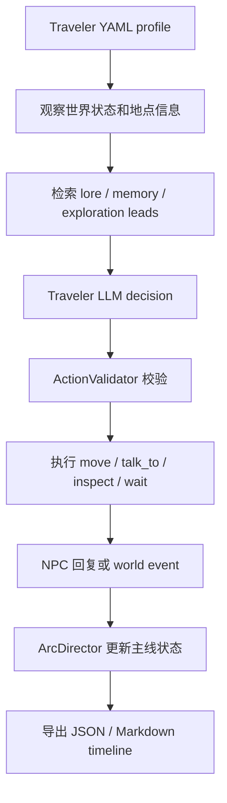

# 记忆驱动的可验证 LLM 角色 Agent 系统设计与实现

## 摘要

本项目以文字冒险世界为实验场景，设计并实现了一个基于大语言模型的角色智能体系统。系统将 LLM 用于角色理解、意图生成和自然语言回复，同时将任务推进、关系变化、物品流转和世界状态更新交由规则化执行流程处理。项目从单个非玩家角色（NPC, Non-Player Character）多轮对话原型，逐步扩展为多角色 living-world runtime（动态世界运行时），并加入可配置的 Traveler 自动探索角色和 timeline 导出机制。当前系统能够展示状态读取、记忆检索、角色心智生成、结构化 decision、ActionValidator 校验、SQLite 状态写入和 trace（运行轨迹）复盘等关键环节，为可控交互叙事中的 LLM Agent 提供了一个可运行、可观察的课程项目实现。

## 一、引言

### 1.1 项目背景

LLM 已经能够生成连贯、自然并具有角色风格的文本，因此很适合用于交互叙事、文字冒险和游戏角色对话。然而，仅依赖 LLM 生成回复并不能构成稳定的角色系统。一个真正可持续运行的角色 Agent 需要记住过去发生的事件，理解当前世界状态，遵守任务规则，并在多轮交互中保持人物设定和行为边界。

本项目选择文字冒险世界作为验证场景，是因为这种环境既有叙事空间，又相对可控。角色可以围绕地点、物品、任务、关系和秘密展开互动；同时，世界状态可以用数据库和任务状态机明确表示，便于检查 LLM 输出是否真正影响了系统状态。

### 1.2 问题定义

普通聊天机器人通常只生成自然语言，缺少稳定的世界模型和可审计的行动链路。它可能在回复中声称玩家获得了钥匙、解锁了遗迹入口或赢得了某个角色信任，但这些内容如果没有写入程序状态，就只是文本层面的叙述。相反，如果允许 LLM 直接修改世界状态，又容易出现越权、幻觉和不一致问题。

因此，本项目关注的问题是：如何让 LLM 参与角色认知、目标选择、行动意图和语言生成，同时保证世界事实、任务推进和状态变化仍由系统流程控制。

### 1.3 项目目标

项目目标是构建一个由记忆、状态、行动校验和运行轨迹共同支撑的 LLM 角色 Agent 系统。具体而言，系统需要支持 NPC 读取稳定世界设定、检索长期记忆、形成主观信念和行动计划，并通过结构化 decision 提出行动；同时，所有可能改变世界的行为都必须经过 ActionValidator 和任务状态机校验。系统还需要导出 trace 和 timeline，使每次交互的输入、检索、推理、决策、校验、状态变化和回复生成过程都可以复盘。

## 二、项目发展历程

项目的发展不是简单堆叠功能，而是围绕“让 LLM 角色更稳定、更可控、更容易解释”逐步推进。整体可以压缩为四个阶段。

### 2.1 单 NPC 记忆对话原型

第一阶段解决的是基础可行性问题：如何让一个 NPC 在多轮对话中读取状态、调用 LLM、生成回复并留下可检查的记录。项目最初建立了 SQLite 数据库、基础 NPC workflow、prompt、response 生成、Streamlit 调试台和 trace 导出机制。这一阶段证明了文字冒险环境可以作为 LLM 角色 Agent 的实验载体，也为后续的记忆、任务和状态执行打下基础。

该阶段的核心流程可以用如下伪代码概括：

```text
player_input
-> load_npc_state(SQLite)
-> load_recent_context()
-> build_llm_prompt(state, context, player_input)
-> llm_generate_decision_and_reply()
-> execute_allowed_tools()
-> write_state_and_trace(SQLite)
-> return_npc_reply()
```

这一流程说明，项目最初关注的是“输入如何进入角色回合、角色如何生成回复、状态和 trace 如何保存”。虽然此时系统结构还比较简单，但已经避免了只保存聊天文本而不记录状态变化的问题。

### 2.2 分层上下文、长期记忆与玩家端交互

第二阶段解决的是上下文不足和交互表面单一的问题。系统加入 lore retrieval（世界设定检索）、长期记忆、语义检索、Hybrid RAG（混合检索增强生成）和后台 memory jobs。角色不再只依赖最近几轮对话，而是可以结合稳定世界设定、近期上下文和长期记忆进行回答。同时，项目加入 FastAPI 后端、React/Vite 玩家端和更完善的任务流程，使系统从调试型 demo 扩展为可交互原型。

这一阶段的外部形态变化体现在玩家端界面中。项目不再只有命令行或 Streamlit 调试视图，而是开始提供面向玩家的 RPG 风格交互界面。


图 1 早期 React/Vite 玩家端界面快照

这一快照对应项目从“后端 Agent 原型”向“可交互应用”扩展的阶段。前端负责呈现地点、角色、物品和对话；FastAPI 后端继续复用同一套 Agent workflow，保证界面操作和状态写入使用一致的逻辑。

### 2.3 NPCMind、NarrativeEnvironment 与行动校验

第三阶段解决的是 LLM 输出难以控制的问题。系统引入 NPCMind 和 NarrativeEnvironment。NPCMind 负责从 observation（观察）中生成 belief、emotion、goal、plan 和 social strategy；NarrativeEnvironment 负责组织 observation，并把 LLM 的结构化 decision 转换为程序可执行的 NPCAction。随后引入 ActionValidator，将非法或越界行动降级为安全结果。这一阶段形成了明确的职责边界：LLM 参与认知和表达，系统流程掌握事实和执行权。

这一阶段的关键变化可以概括为从“直接生成回复”转向“先形成心智状态，再提出可校验行动”：

```text
observation = NarrativeEnvironment.observe(input, state, retrieved_context)
mind_state = NPCMind.update(observation)

decision = LLM.decide(
    observation=observation,
    belief=mind_state.belief,
    emotion=mind_state.emotion,
    goal=mind_state.active_goal,
    plan=mind_state.active_plan,
    allowed_actions=action_surface
)

action = NarrativeEnvironment.to_action(decision)
validated = ActionValidator.validate(action, current_world_state)
result = NarrativeEnvironment.execute(validated)
```

这段伪代码体现了系统的边界：LLM 可以提出行动意图，但真正改变任务、地点、关系和物品状态的是 `validate` 与 `execute` 之后的结果。这样能够解释为什么 NPC 的一句自然语言回复不能直接等同于世界事实已经改变。

### 2.4 多角色 living-world runtime 与 Traveler 自动探索

第四阶段解决的是系统从单轮对话到多角色世界运行的问题。项目加入 autonomous NPC runtime（自主 NPC 运行时），使 NPC 可以响应 world event、接收事件 inbox、通过 ActionCatalog 选择允许行动，并生成计划或主动消息。随后系统扩展为 living-world runtime，引入 ArcDirector、世界主线、NPC routines 和可变结局。最后，项目加入 Traveler 自动探索者。Traveler 由 YAML profile 配置，拥有身份、私人目标、隐藏背景、行动边界和探索风格，可以自动观察世界、选择行动、询问 NPC，并导出 JSON 和 Markdown timeline。

Traveler 阶段的运行方式可以用下图表示：



图 2 Traveler living-world runtime 运行流程

当前仓库中的 `data/traces/classroom_showcase_llm_run/20260606T061944-classroom_showcase_scholar.md` 和 `data/traces/sable_advantage_llm_run/20260606T185547-ambitious_patron_scholar.md` 展示了这一阶段的真实运行结果。前者强调课堂展示中的多 NPC 覆盖和证据收集路线，后者展示了偏向 Sable 的非正式信息路线。两类 trace 都记录了 Traveler 的行动理由、NPC 回复、状态变化、arc evidence 和 timeline 导出结果。

## 三、系统设计与实现

### 3.1 世界状态与任务状态机

系统使用 SQLite 保存核心状态，包括 NPC 状态、玩家或 Traveler 状态、任务进度、物品、地点、世界事件和交互日志。当前世界中包含 Lina、Ron、Mira 和 Sable 等 NPC。不同 NPC 拥有独立任务、关系状态、知识边界和社交倾向。

任务状态机负责保证任务推进符合规则。以找钥匙、守卫凭证、古代笔记和遗迹线索等任务为例，系统不会仅因为 LLM 在回复中提到“任务完成”就更新状态，而是要求 action 经过校验后写入数据库。这样可以防止自然语言回复和真实世界状态脱节。

### 3.2 记忆与检索系统

系统的记忆分为近期上下文、长期记忆和稳定 lore。近期上下文保存最近交互，长期记忆记录更持久的重要事实，lore 则描述世界背景、角色设定和规则信息。长期记忆具有类型和元数据，例如 semantic、episodic、relational、procedural，以及 evidence、scope、facets、stability 和 future_usefulness 等字段。

检索系统支持多种模式，包括 typed retrieval、semantic retrieval 和 Hybrid RAG。Hybrid RAG 结合规则匹配和语义相似度，使角色能够在玩家表达不完全匹配关键词时仍然找到相关记忆。后台 memory jobs 负责长期记忆候选生成、审查、去重、写入和 embedding 更新，避免实时回合被记忆处理阻塞。

### 3.3 NPCMind 与 NarrativeEnvironment

NPCMind 是角色心智层，用于把 observation 转换为主观状态。它会生成 belief、emotion、active goal、active plan 和 social strategy，使角色在回复前先形成可记录的内部判断。例如，一个 NPC 可以基于玩家话语、历史交互和当前任务状态判断玩家是否可信，进而决定是透露线索、要求凭证还是转移话题。

NarrativeEnvironment 是叙事环境层，负责构造 observation，并把 LLM 输出和 NPCMind 上下文转换成 NPCAction。它将“角色如何理解当前局面”和“系统如何执行行动”分开，使每一步都可以写入 trace 并被测试。

### 3.4 ActionValidator 行动校验

ActionValidator 是系统的行动边界。LLM 可以提出结构化 decision，但不能直接修改 SQLite 中的任务、物品、地点或关系状态。ActionValidator 会检查行动是否在当前状态下允许执行，并在非法时返回安全降级结果。

例如，Sable 可以通过语言进行试探、误导或转移话题，但不能直接绕过任务规则解锁遗迹入口；Ron 可以要求玩家提供凭证，但不能在缺少条件时泄露守卫信息；Mira 可以要求实地证据，但相关任务是否推进仍由状态机决定。这种机制保证了角色语言的灵活性与系统状态的可靠性并存。

### 3.5 用户界面与后端接口

项目提供三类交互和展示入口。Streamlit 调试台用于开发和课堂展示，可以查看 NPC 选择、状态面板、检索预览、执行轨迹、工具调用和状态变化。FastAPI 后端将同一套 Agent workflow 暴露为接口，支持普通对话、检索预览、trace 导出、embedding rebuild、memory job 处理、world event 提交和 autonomous tick。React/Vite 玩家端提供更接近游戏体验的界面，并保留开发者 trace 面板。

这种多入口设计使项目既可以作为技术系统调试，也可以作为课堂演示材料，还可以继续扩展为用户可交互的文字冒险原型。

### 3.6 autonomous NPC runtime

autonomous NPC runtime 用于让 NPC 响应世界事件，而不是只等待玩家输入。其核心流程是：world event 写入后进入 NPC event inbox；系统根据 NPC 当前状态和 ActionCatalog 构造可行动作集合；LLM 输出 constrained decision；ActionValidator 校验后执行；结果写入 mailbox、runtime state 和 trace。

这一机制使 NPC 具备一定主动性。例如，NPC 可以根据世界事件更新计划、产生主动消息或改变对玩家的态度。虽然当前演示中为了成本和稳定性会限制独立 NPC tick 的数量，但这一模块已经为多 Agent 调度提供了基础。

### 3.7 Traveler runtime 与 timeline export

Traveler 是 living-world simulation 中的自动探索者。它不是普通玩家输入，而是由 YAML profile 配置的角色 Agent，包含公开身份、背景、私人目标、隐藏信息、行动边界、探索风格和初始位置。Traveler 每轮会观察世界状态、检索相关记忆和线索、选择移动、询问、检查或等待等行动，并通过校验后影响世界。

timeline export 将运行过程导出为 JSON 和 Markdown。导出内容包括 round、Traveler 行动理由、Traveler 发言、NPC 回复、状态变化、探索线索、timing breakdown、arc evidence、ambient arc signals 和最终 outcome。该机制使系统结果不只是一次演示，而是可以复盘、比较和写入课程报告的证据材料。

### 3.8 模块职责表

| 模块 | 主要职责 | 输入 | 输出 |
| --- | --- | --- | --- |
| NarrativeEnvironment | 构造 observation，将 decision 与心智上下文转换为可执行行动 | 玩家或 Traveler 输入、当前世界状态、NPC 状态 | Observation、NPCAction、ActionResult |
| NPCMind | 生成角色内部判断，包括 belief、emotion、goal、plan 和 social strategy | Observation、近期上下文、长期记忆、lore | 角色心智状态、计划步骤、reflection |
| Memory / Retrieval System | 加载近期上下文，检索长期记忆和稳定世界设定 | 当前输入、NPC ID、任务状态、embedding 或规则检索条件 | memory snippets、lore snippets、检索评分信息 |
| LLM Decision | 基于上下文和角色心智输出结构化 decision 与自然语言草稿 | observation、retrieval result、NPCMind context、可行动作集合 | structured decision、traveler utterance、response draft |
| ActionValidator | 判断行动是否符合当前规则，拦截或降级非法行动 | structured decision、NPCAction、任务状态、地点和物品状态 | allowed / blocked / repaired result、blocked reason |
| SQLite World State | 持久化 NPC、玩家、Traveler、任务、物品、地点和事件 | 经校验的 ActionResult、工具执行结果、memory job 输出 | 更新后的世界状态、交互日志、事件记录 |
| Timeline Export | 将运行过程整理为可阅读和可复盘的输出 | rounds、traveler tick、npc tick、arc update、state changes | JSON timeline、Markdown timeline |
| Traveler Runtime | 根据 profile 自动观察、决策、移动、询问和反思 | YAML profile、world state、available actions、retrieval result | Traveler action、relationship changes、round trace |
| autonomous NPC Runtime | 让 NPC 响应 world event 并生成主动行为或消息 | world events、npc_event_inbox、ActionCatalog、NPC state | autonomous tick result、proactive message、autonomous trace |

## 四、系统架构图


图 3 系统总体运行流程

如果最终提交为 Word 或 PDF，应将 Mermaid 图渲染为图片插入正文，Markdown 中保留源码作为备份。

该架构将 LLM 输出和世界状态更新分离。LLM 在 observation、记忆和角色心智基础上提出结构化 decision，并生成自然语言表达；它不能直接写入 SQLite，也不能直接改变任务状态。所有会影响世界事实的行为都需要经过 ActionValidator、任务状态机和 NarrativeEnvironment 的执行逻辑。即使 LLM 在语言上提出了不合规则的行动，系统也会将其拦截或降级为安全行为。

## 五、项目特色与创新点

### 5.1 语言生成与状态执行分离

本项目在架构上采用“LLM 生成意图，系统执行状态变化”的设计。LLM 负责理解上下文、形成角色化表达和提出行动意图；NarrativeEnvironment、ActionValidator 和任务状态机负责判断该行动是否可以改变数据库状态。这样，NPC 的自然语言回复不会自动等同于任务完成、物品获得或地点解锁，状态变化必须通过 `update_trust`、`give_item`、`update_quest_status`、`unlock_location` 等工具路径写入。

### 5.2 可解释 trace

系统将中间过程写入 trace，而不是只保存最终回复。trace 中包含检索结果、observation、belief、goal、plan、decision、ActionValidator 结果、工具调用、状态变化、reflection、timing 和 memory job。报告和调试过程中可以沿着“状态读取 → 记忆检索 → 心智生成 → decision → 校验 → 状态写入 → timeline 导出”的路径检查一次交互为何产生某种结果。

### 5.3 多 NPC 角色边界

Lina、Ron、Mira 和 Sable 的区别不只体现在名字和台词上，也体现在任务、知识范围和社交策略上。Ron 更强调凭证和守卫记录，Mira 更关注证据和研究线索，Sable 则可以进行试探、转移话题或部分误导。系统通过角色设定、NPCMind 和 ActionValidator 共同限制这些行为，使角色可以在语言层面表现出差异，但不能绕开机制直接改写世界事实。

### 5.4 后台长期记忆流程

长期记忆不在实时回合中直接写入，而是通过 memory job 进入后台流程。系统会生成候选记忆、进行审查、应用记忆策略和去重，再写入长期记忆并更新 embedding。这种拆分使对话主流程不必等待完整记忆维护过程，也让后续评估可以分别检查“当轮回复是否合理”和“长期记忆是否值得保存”。

### 5.5 多种 demo 与验证路径

项目保留了多条演示路径：普通 NPC 对话用于检查单回合行为，FastAPI workflow 用于验证接口层，Streamlit 调试台用于查看状态和 trace，React/Vite 玩家端用于展示交互界面，autonomous NPC demo 用于观察 NPC 对 world event 的响应，Traveler world demo、classroom showcase trace 和 Sable route demo 用于分析自动探索和不同 profile 下的行为差异。这些路径覆盖了从单角色对话到多角色运行时的主要场景。

## 六、结果展示与分析

本章结果主要来自当前仓库中的 Streamlit 调试台、FastAPI workflow、Traveler world demo、classroom showcase trace、Sable route demo，以及 JSON / Markdown timeline 导出文件。报告采用典型运行路径和 trace 复盘进行定性分析，不虚构大规模统计数据、用户测试数量或性能结论。

| 测试场景 | 验证目标 | 系统表现 | 说明 |
| --- | --- | --- | --- |
| 单 NPC 多轮对话 | 验证 NPC 能否读取状态、记忆和 lore，并在多轮中保持上下文 | 系统能够根据近期交互、长期记忆和任务状态生成回复，并记录 trace | 适合展示基础 Agent workflow 和记忆检索路径 |
| Ron 凭证任务 | 验证任务条件和角色知识边界 | Ron 会围绕凭证、守卫记录和授权信息进行回应，不在条件不足时直接泄露关键信息 | 体现任务状态机和角色身份约束 |
| Sable 路线 | 验证误导型角色能否保持语言灵活性但不越权改写事实 | Sable 可以试探、转移话题或引导 Traveler，但状态变化仍需经过校验 | 体现语言行为和世界状态执行的分离 |
| Traveler 自动探索 | 验证自动探索者是否能根据 profile 观察、选择行动并推动主线 | Traveler 能够移动、询问 NPC、跟随线索并产生可导出的运行过程 | 体现从手动玩家输入到自动 Agent 运行的扩展 |
| classroom showcase trace | 验证课堂展示中是否能呈现多 NPC 对话和完整故事线 | trace 展示 Traveler 发言、NPC 回复、关系变化、探索线索和 arc evidence | 适合作为报告和演示中的主要结果材料 |
| timeline 导出 | 验证系统运行是否可复盘 | JSON 和 Markdown timeline 能记录 round、行动理由、状态变化、timing 和 outcome | 体现系统的可审计性 |

从这些场景可以看出，当前项目已经不只是一个聊天界面，而是形成了状态读取、记忆检索、心智生成、行动校验和结果导出的运行链路。尤其在 Traveler runtime 中，不同 profile 会影响探索策略和互动对象。例如，谨慎求真的 Traveler 倾向于采访多个 NPC 并交叉验证线索，而更追求声望和独占发现的 Traveler 会更主动接近 Sable 的非正式信息网络。这表明 profile 配置已经能够影响行为路线，而不只是作为文本说明存在。

同时，结果也暴露出系统原型阶段的限制。LLM 决策可能带来较长等待时间；复杂多 Agent 调度仍需谨慎控制；部分结果需要通过 trace 判断，而不是只看最终自然语言回复。因此，当前系统更适合用于课堂展示、结构验证和研究原型，而不是直接作为完整游戏产品。

### 6.1 典型 trace 示例

以下片段摘自仓库中的真实运行输出 `data/traces/sable_advantage_llm_run/20260606T185547-ambitious_patron_scholar.{json,md}`，并为了报告阅读进行了字段简化。该轮展示了 Traveler 与 Sable 对话时，系统如何从输入进入检索、心智生成、结构化 decision、行动校验和状态更新流程。

| 字段 | 简化后的真实运行片段 |
| --- | --- |
| Round | 5 |
| Traveler action | `talk_to` |
| Target NPC | `sable` |
| Traveler reason | Sable 是非正式信息渠道的关键角色；Traveler 希望建立信任并获取遗迹传闻，同时不完全暴露自己追求独占发现的私人目标。 |
| Retrieved memory/lore | 当前地点为 `market`；Traveler profile 中包含“利用 Lina、Ron、Mira 了解他们保护的内容，再把模式带回 Sable”的私人笔记；exploration leads 指向守卫台账和酒馆后巷等线索。 |
| NPCMind belief | Sable 的后续 reflection 记录为：玩家可能知道有利可图的遗迹线索。 |
| NPC decision intent | `redirect_ruins_inquiry` |
| ActionValidator result | Traveler 行动校验状态为 `allowed`；Sable 对话 action result 为 `accepted=true`。 |
| State change | Sable 的关系状态发生变化：trust 从 `0.05` 到 `0.10`，affinity 从 `0.10` 到 `0.20`；NPC action result 中的 SQLite 侧 trust 字段从 `16` 到 `21`。 |
| NPC reply | “埃利安，私人保存调查？那听起来是个需要耐心和精明眼光的行当。这儿的废墟传闻总是被层层包裹……” |
| Trace note | response constraints 明确包含“不要声称地下遗迹入口已解锁或可用”“不要声称玩家获得了物品奖励”。因此，NPC 的自然语言回复可以继续试探和引导，但不能直接完成任务或解锁地点；任务推进和地点变化仍由程序规则控制。 |

这个 trace 示例说明，系统记录的不只是对话文本，还包括 Traveler 的动机、角色关系变化、NPC 的内部判断、校验结果和回复约束。自然语言可以影响角色关系或生成新的世界事件，但是否解锁地点、完成任务或发放物品，仍取决于 ActionValidator 和任务状态机。

## 七、系统评估

本项目当前主要依赖 demo trace、JSON / Markdown timeline 和人工复盘进行评估，尚未形成大规模自动化量化评测。下表将评估指标与当前已有证据来源对应起来，说明目前能观察到什么、局限在哪里，以及后续如何改进。

| 评估指标 | 当前证据来源 | 当前观察结论 | 局限性 | 后续改进方向 |
| --- | --- | --- | --- | --- |
| 角色一致性 | NPCMind trace、lore、长期记忆、classroom showcase trace | NPC 的语气、知识边界和行动倾向可以通过 trace 复盘；Ron、Mira、Sable 等角色在典型场景中表现出不同约束 | 目前主要依赖人工阅读，缺少自动检测人设漂移的工具 | 增加固定多轮对话集，检查角色立场和知识边界是否前后一致 |
| 状态一致性 | SQLite 状态变化、ActionValidator trace、任务状态机日志 | 自然语言回复与状态写入被分开记录，任务和关系变化可以追溯到工具执行或 ActionResult | 尚未形成跨全部 demo 的自动一致性统计 | 增加脚本对比回复声明、state_before、state_after 和 state_changes |
| 行动越权率 | ActionValidator result、response constraints、NPCAction 记录 | 典型 trace 中可以看到非法状态声明被约束，例如不允许直接声称遗迹入口已解锁 | 当前只说明拦截路径存在，没有按行动类型统计频次 | 对 blocked、repaired、allowed 行动进行分类汇总 |
| 任务推进成功情况 | 任务状态机、world event、Traveler timeline、arc update | 任务推进和 arc outcome 能通过 timeline 复盘，典型 demo 可展示主线如何变化 | 不同任务线尚未形成统一验收集 | 为每条任务线设计固定初始状态、输入序列和期望状态 |
| 记忆检索相关性 | retrieval trace、memory snippets、lore snippets、Hybrid RAG 记录 | 系统能够把近期上下文、长期记忆和 lore 纳入 decision；部分 demo 展示了线索路由 | 缺少人工标注的查询集，难以量化相关性 | 建立小规模标注样例，比较 typed、semantic 和 hybrid 检索结果 |
| 不同 Traveler profile 的行为差异 | classroom showcase trace、Sable route demo timeline、Traveler YAML profile | 不同 profile 会影响行动对象、话题选择和路线倾向，例如求真型 Traveler 与声望导向 Traveler 的策略不同 | 当前比较主要来自少数典型运行，尚不能代表所有 profile | 在相同初始世界状态下重复运行不同 profile，并记录路线差异 |
| trace 可解释性 | JSON timeline、Markdown timeline、Streamlit trace 面板 | trace 能展示输入、检索、decision、校验、状态变化和回复约束，便于定位行为原因 | 文本 trace 较长，课堂展示时阅读成本较高 | 将 timeline 转为图形化回放界面，突出关键状态变化 |
| 响应延迟和运行开销 | timeline 中的 timing breakdown、Traveler tick 内部耗时字段 | 系统已记录 observe、retrieve、decide、act、reflect 等阶段耗时，便于定位开销来源 | 报告未进行稳定基准测试，也不据此给出性能结论 | 建立固定轮数、固定 profile、固定模型配置下的运行开销记录 |

总体来看，当前系统已经具备较完整的观测点，但评估仍以案例分析和 trace 复盘为主。未来可以在现有 timeline 基础上构建自动分析脚本，使角色一致性、状态一致性、越权行为和任务推进情况能够被更系统地统计和比较。

## 八、问题与不足

第一，多 Agent 调度仍然受限。当前系统已经支持 Traveler、NPC autonomous tick 和 world arc，但为了保证演示稳定性和控制 LLM 调用成本，课堂展示中经常需要限制独立 NPC tick 的数量。多个 Agent 同时行动时，事件顺序、冲突解决和主线推进仍需要更成熟的 scheduler。

第二，长期记忆质量仍需优化。系统已经有 memory jobs、候选记忆、审查、去重和 embedding 更新，但长期记忆是否真正有助于后续决策，还需要更系统的评估。记忆冲突、过时记忆、跨 NPC 信息共享和遗忘机制也还可以继续完善。

第三，评估体系还不够系统。当前项目有自动测试和 trace 证据，但更多验证仍依赖人工阅读报告和运行记录。未来需要将角色一致性、状态一致性、越权率、任务推进和检索相关性等指标转化为更稳定的测试集和分析脚本。

第四，前端展示和可视化仍不够直观。React/Vite 玩家端和 Markdown timeline 已经能够展示系统运行结果，但对于多角色、多事件、多轮状态变化而言，纯文本 trace 阅读成本较高。更理想的方式是提供时间轴、状态变化图和角色关系变化视图。

第五，世界规模和剧情复杂度有限。当前实验主要围绕 Grayhaven ruins 的地点、任务和角色展开，已经足以验证系统架构，但距离更大规模的开放叙事世界仍有差距。更多地点、任务分支、角色阵营和长期后果会带来新的挑战。

第六，LLM 调用带来响应延迟和成本问题。Traveler 决策、NPC 回复、记忆候选生成和记忆审查都可能调用 LLM。虽然系统已经拆分了后台流程，并在部分 demo 中支持 mock 或限制 tick 数量，但真实运行中的延迟和成本仍是后续必须考虑的问题。

## 九、未来工作

未来工作首先应继续完善多 Agent 调度机制。理想状态下，Traveler、多个 NPC 和 ArcDirector 能以清晰的顺序交替运行，系统既能呈现丰富的自主行为，又不会因为事件过多导致主线失控。

其次，需要加强长期记忆系统。后续可以增加记忆可信度、冲突记忆处理、记忆遗忘、跨 NPC 信息传播和记忆使用效果评估，使长期记忆不只是被存储，而是真正影响角色决策。

第三，应构建更系统的评估工具。当前 trace 已经提供了丰富证据，未来可以在此基础上自动提取任务推进、非法行动、状态变化、profile 行为差异和响应耗时，从而形成更可比较的实验结果。

第四，可以改进前端和 timeline 可视化。将 JSON timeline 转换为图形化回放界面，用时间轴展示 Traveler 行动、NPC 回复、世界事件、arc phase 和状态变化，有助于降低课堂展示和报告阅读成本。

第五，可以扩展世界规模和剧情结构。在保持 ActionValidator 和任务状态机边界的前提下，增加更多地点、NPC、任务线和可变结局，使系统从单一遗迹 demo 扩展为更完整的交互叙事实验平台。

## 十、总结

本项目围绕可控 LLM 角色 Agent 的设计目标，构建了一个以文字冒险世界为验证场景的课程实现。系统的核心不是让 LLM 自由生成一段看似合理的角色回复，而是把 LLM 放入受规则约束的运行流程中：角色先读取世界状态、近期上下文、lore 和长期记忆，再由 NPCMind 形成 belief、emotion、goal、plan 和 social strategy，随后由 LLM 输出结构化 decision，最后经过 ActionValidator、任务状态机和 NarrativeEnvironment 执行逻辑，才允许改变 SQLite 中的世界状态。

在实现过程中，项目从单 NPC 多轮对话逐步扩展到多 NPC、长期记忆、Hybrid RAG、后台 memory jobs、FastAPI 接口、React/Vite 玩家端、autonomous NPC runtime、living-world runtime 和 Traveler 自动探索者。当前系统已经能够支持普通玩家回合、自主 NPC 响应、Traveler 自动探索、classroom showcase trace 和 timeline 导出。通过这些运行路径，报告可以展示角色如何检索记忆、如何形成行动意图、如何受到规则约束，以及世界状态如何被真实更新。

项目较关键的设计是将语言生成与状态执行分离。LLM 提供自然语言能力和角色推理能力，系统流程维护事实、校验行动并记录结果。这种设计既保留了 LLM 在交互叙事中的表达优势，也降低了幻觉和越权行动对系统状态的破坏。trace 和 timeline 则进一步增强了系统的可复盘性，使每一次交互都可以沿着输入、检索、decision、校验和状态写入的路径进行检查。

总体而言，本项目已经形成了一个可运行的 LLM 角色 Agent 原型，能够体现记忆、状态、行动、校验和解释之间的关系。后续如果继续发展，应重点加强多 Agent 调度、长期记忆质量、系统评估、可视化展示和世界规模扩展，使其从课堂演示进一步成长为可用于研究交互叙事和可验证 LLM Agent 的实验平台。
